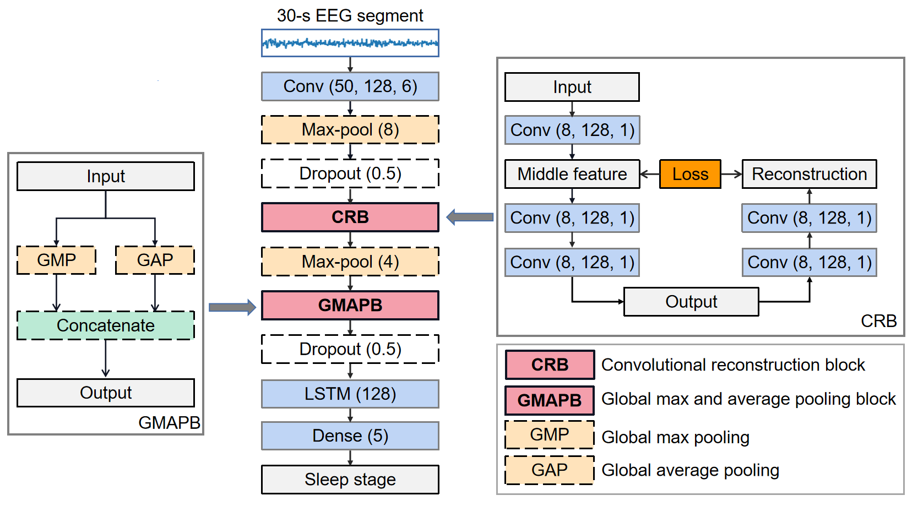
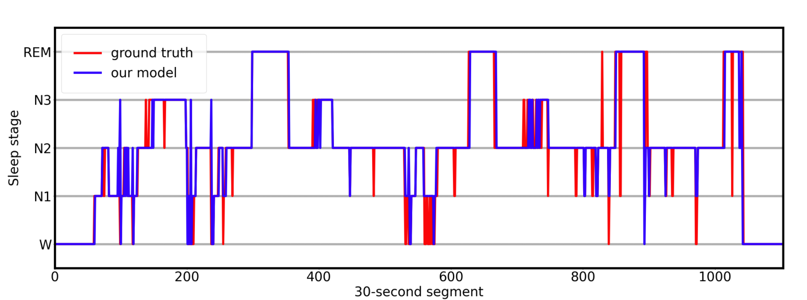

# RecSleepNet: An Automatic Sleep Staging Model Based on Feature Reconstruction

Sleep staging via electroencephalogram (EEG) is the fundamental step to sleep quality assessment and disease diagnose. Deep learning methods have been demonstrated to be promising for automatic sleep staging, but the performance is still not satisfied, because learning representations over the EEG signals is very challenging.

In this study, we propose RecSleepNet, an automatic sleep staging model based on a hybrid structure of Convolutional Neural Networks (CNN) and Long Short Term Memory (LSTM) networks. To enhance the representation learning, we devise a Convolutional Reconstruction Block (CRB), which enforces the extracted features to reconstruct the previous low-level input well. The use of CRB also speeds up the training process. 

Moreover, we introduce a Global Max and Average Pooling Block (GMAPB) to squeeze parameter numbers and extract shift-invariant features. Experiments on four public datasets of single-channel EEG signals indicate that RecSleepNet achieves better or at least comparable performance to the state-of-the-art methods. CRB and GMAPB enable the training to be more efficient with fewer parameters but faster convergence.



## Requirements

* numpy >= 1.16.1
* pandas >= 0.24.1
* scikit-learn>=0.20.3
* scipy>=1.21
* tensorflow-gpu==1.13.1
* mne=0.18.2

## Data preparing

We used three datasets: [SleepEDF](https://www.physionet.org/content/sleep-edf/1.0.0/), [ISURC](https://sleeptight.isr.uc.pt/) and [UCDDB](https://physionet.org/content/ucddb/1.0.0/) to evaluate RecSleepNet.
All labels annotated by the R\&K manual were transformed to the AASM manual. All MOVEMENT and UNKNOWN sleep segments were excluded. All EEG signals were re-sampled at 100Hz. All EEG segments 30 minutes before first and after last non-W segment were excluded. 

The default preprocessed data directory is "./data".

A whole night's EEG file should be a "*.npz" file which includes "x": EEG signal and "y":labels.

For example, "./data/isruc/subject0.npz", "./data/ucddb/ucddb002.npz" and "./data/sleepedf/SC4001E0.npz" respectively correspond to the records in ISRUC, UCDDB and SleepEDF datasets.

Preprocessing ISRUC dataset:

 ```shell 
python prepare_isruc.py --data_dir "./raw_data/isruc" --output_dir "./data/isruc" --select_ch "EEG Fpz-Cz" 
 
 ```

Some of the available arguments are:

| Argument   | Description                          | Default         |
| ---------- | :----------------------------------- | --------------- |
| data_dir   | the path of raw psg files            | None/Required   |
| output_dir | the path of npz files                | None/Required   |
| select_ch  | which EEG channel will be extracted" | C3A2/EEG Fpz-Cz |

## Training

Runing a cross validation experiment on ISRUC:

 ```shell 
python trainer.py --db isurc --gpu 0 --from_fold 0 --to_fold 9
 
 ```

Some of the available arguments are:

| Argument          | Description                                 | Default       |
| ----------------- | :------------------------------------------ | ------------- |
| db                | dataset (sleepedf, sleepedfx, isruc, ucddb) | None/Required |
| gpu               | gpu number                                  | 0             |
| from_fold/to_fold | start fold number and end fold number       | None/Required |
| suffix            | the suffix of the directory name            | None          |

Hyper-parameters could be set by config.py

## Quick validation

you can just run 

```Python
    python predict.py --dataset isruc --dir ./pretrained_model
```

to evaluate pre-trained models.

Some of the available arguments are:

| Argument | Description                                 | Default            |
| -------- | :------------------------------------------ | ------------------ |
| db       | dataset (sleepedf, sleepedfx, isruc, ucddb) | isruc              |
| dir      | directory of pre-trained models             | ./pretrained_model |

## Result



The whole night sleep stages annotated by our model and sleep experts for subject-1 in SEDF-39 dataset. 

## Acknowledgement

This project is edited from the project [TinySleepNet]([TinySleepNet](https://physionetchallenges.org/2020/). ). 

## Licence

- For academic and non-commercial use only
- Apache License 2.0
